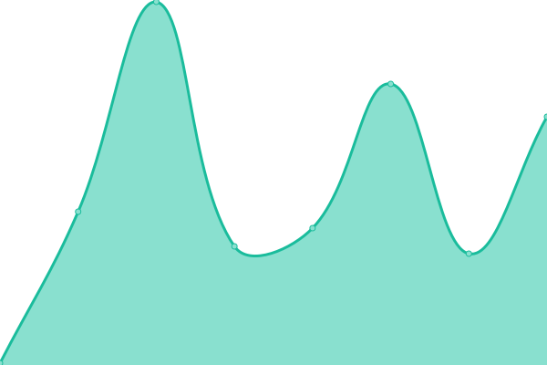
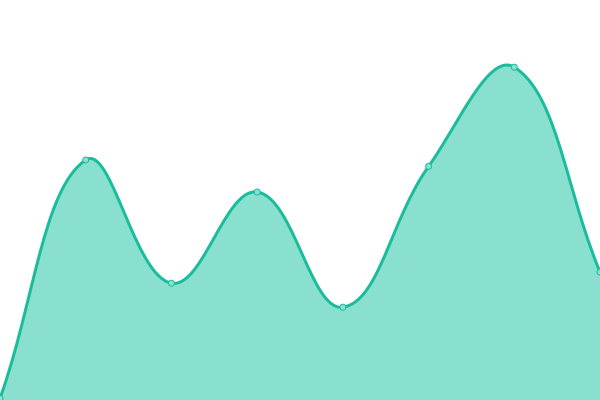
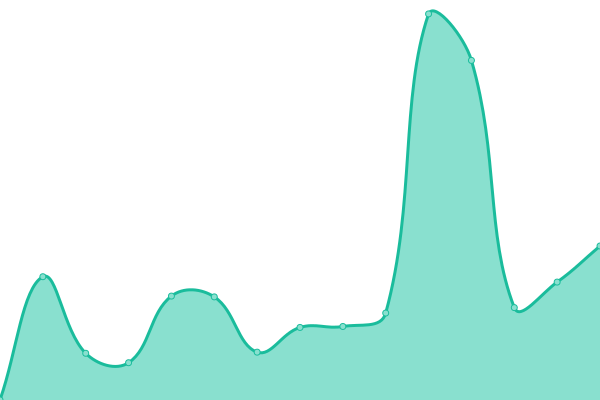
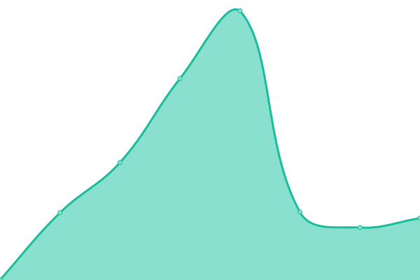

# [📈 Live Status](https://codeforces.uptime.xcpcio.com): <!--live status--> **🟧 Partial outage**

This repository contains the open-source uptime monitor and status page for [XCPCIO](https://xcpcio.com), powered by [Upptime](https://github.com/upptime/upptime).

With [Upptime](https://upptime.js.org), you can get your own unlimited and free uptime monitor and status page, powered entirely by a GitHub repository. We use [Issues](https://github.com/XCPCIO/codeforces.uptime/issues) as incident reports, [Actions](https://github.com/XCPCIO/codeforces.uptime/actions) as uptime monitors, and [Pages](https://codeforces.uptime.xcpcio.com) for the status page.

<!--start: status pages-->
<!-- This summary is generated by Upptime (https://github.com/upptime/upptime) -->
<!-- Do not edit this manually, your changes will be overwritten -->
<!-- prettier-ignore -->
| URL | Status | History | Response Time | Uptime |
| --- | ------ | ------- | ------------- | ------ |
|  [Codeforces](https://codeforces.com) | 🟩 Up | [codeforces.yml](https://github.com/xcpcio/codeforces.uptime/commits/HEAD/history/codeforces.yml) | 

 391ms
     
 | 

<a href="https://codeforces.uptime.xcpcio.com/history/codeforces">98.21%</a>
    

|  [Polygon](https://polygon.codeforces.com) | 🟩 Up | [polygon.yml](https://github.com/xcpcio/codeforces.uptime/commits/HEAD/history/polygon.yml) | 

 553ms
     
 | 

<a href="https://codeforces.uptime.xcpcio.com/history/polygon">99.05%</a>
    

|  [m1](https://m1.codeforces.com) | 🟩 Up | [m1.yml](https://github.com/xcpcio/codeforces.uptime/commits/HEAD/history/m1.yml) | 

 871ms
     
 | 

<a href="https://codeforces.uptime.xcpcio.com/history/m1">98.14%</a>
    

|  [m2](https://m2.codeforces.com) | 🟩 Up | [m2.yml](https://github.com/xcpcio/codeforces.uptime/commits/HEAD/history/m2.yml) | 

 281ms
     
 | 

<a href="https://codeforces.uptime.xcpcio.com/history/m2">99.05%</a>
    

|  [m3](https://m3.codeforces.com) | 🟩 Up | [m3.yml](https://github.com/xcpcio/codeforces.uptime/commits/HEAD/history/m3.yml) | 

 592ms
     
 | 

<a href="https://codeforces.uptime.xcpcio.com/history/m3">100.00%</a>
    

|  [codeforc.es](https://codeforc.es) | 🟥 Down | [codeforc-es.yml](https://github.com/xcpcio/codeforces.uptime/commits/HEAD/history/codeforc-es.yml) | 

 0ms
     
 | 

<a href="https://codeforces.uptime.xcpcio.com/history/codeforc-es">0.00%</a>
    

|  [ml](https://codeforces.ml) | 🟥 Down | [ml.yml](https://github.com/xcpcio/codeforces.uptime/commits/HEAD/history/ml.yml) | 

 0ms
     
 | 

<a href="https://codeforces.uptime.xcpcio.com/history/ml">0.00%</a>
    

|  [cc](https://codeforces.cc) | 🟩 Up | [cc.yml](https://github.com/xcpcio/codeforces.uptime/commits/HEAD/history/cc.yml) | 

 1159ms
     
 | 

<a href="https://codeforces.uptime.xcpcio.com/history/cc">95.51%</a>
    

|  [ga](https://codeforces.ga) | 🟥 Down | [ga.yml](https://github.com/xcpcio/codeforces.uptime/commits/HEAD/history/ga.yml) | 

 0ms
     
 | 

<a href="https://codeforces.uptime.xcpcio.com/history/ga">0.00%</a>
    

<!--end: status pages-->

[**Visit our status website →**](https://codeforces.uptime.xcpcio.com)

## 📄 License

- Powered by: [Upptime](https://github.com/upptime/upptime)
- Code: [MIT](./LICENSE) © [XCPCIO](https://xcpcio.com)
- Data in the `./history` directory: [Open Database License](https://opendatacommons.org/licenses/odbl/1-0/)
